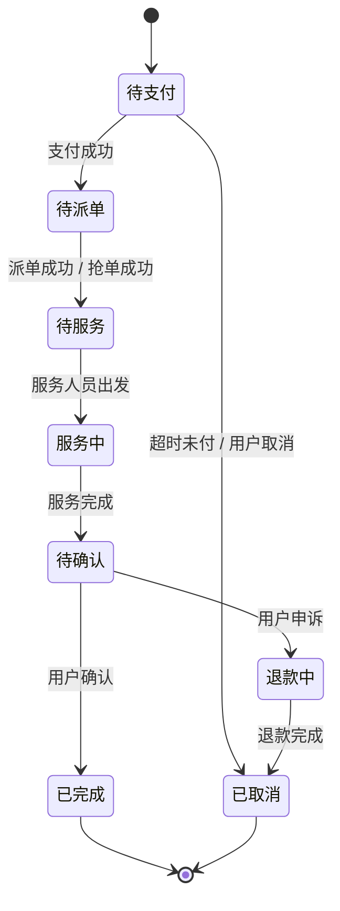

# 家服通 - jfo2o

## 项目简介

家服通是一个基于微服务架构构建的 O2O（Online to Offline）家政服务平台，采用前后端分离开发模式，覆盖**用户端（小程序/App）**、**服务人员端**、**运营管理后台**三大终端，支持用户、服务人员、平台运营三类角色的全流程业务操作。

### 核心功能

- **用户端**：浏览家政服务、在线下单与支付、服务评价、优惠券领取与使用、地址管理、订单全生命周期追踪
- **服务人员端**：实时抢单大厅、订单管理、收入账单统计、实名与技能认证、排班管理
- **运营管理后台**：服务类目管理、订单调度/派单、服务人员审核与管理、营销活动配置（优惠券/秒杀活动）、数据统计与报表、投诉仲裁与退款处理

### 业务流程

项目完整覆盖从用户下单、支付，到服务人员抢单/平台派单，再到服务完成、评价的全业务流程：


### 架构特点

- **微服务架构**：各业务模块独立部署，Spring Cloud Gateway 统一网关入口，Nacos 实现服务注册、发现与配置中心
- **分布式事务**：Seata AT 模式解决跨服务数据一致性问题（如下单时扣库存、核销优惠券、创建订单）
- **异步解耦**：RabbitMQ 消息队列实现服务间异步通信，利用延迟队列处理订单超时取消
- **读写分离**：订单历史数据通过 ShardingSphere 水平分表，热数据与冷数据分离存储
- **缓存策略**：Redis 缓存热点数据，Lua 脚本保障秒杀场景下的原子性操作
- **搜索引擎**：Elasticsearch 实现服务项目全文检索，支持地理位置搜索与智能推荐
- **流量控制**：Sentinel 实现接口级别限流、熔断与降级，保障高并发场景下的系统稳定性
- **分布式调度**：XXL-Job 管理定时任务，如订单超时取消、排班生成、账单结算等

## 技术栈

| 分类    | 技术                   | 版本     | 说明                                |
| :---- | :------------------- | :----- | :-------------------------------- |
| 语言    | Java                 | 11     | LTS 长期支持版本                        |
| 基础框架  | Spring Boot          | 3.2.x  | 微服务基础框架                           |
| 微服务套件 | Spring Cloud         | 2023.x | 整合 Gateway、OpenFeign、LoadBalancer |
| 注册中心  | Nacos                | 2.3.x  | 服务注册、发现与配置中心                      |
| 数据库   | MySQL                | 8.0+   | InnoDB 引擎，ACID 事务                 |
| ORM   | MyBatis Plus         | 3.5.x  | 增强版 MyBatis，支持分页、逻辑删除             |
| 消息队列  | RabbitMQ             | 3.12+  | 异步消息、延迟队列、死信队列                    |
| 缓存    | Redis                | 7.0+   | 缓存热点数据，支持 Lua 脚本与分布式锁             |
| 分布式事务 | Seata                | 1.6.x  | AT 模式，解决跨服务数据一致性                  |
| 分库分表  | ShardingSphere       | 5.4.x  | 订单历史数据水平分表                        |
| 搜索引擎  | Elasticsearch        | 8.11+  | 全文检索与地理位置搜索                       |
| 网关    | Spring Cloud Gateway | 4.1.x  | 统一入口，路由转发，JWT 鉴权过滤                |
| 熔断限流  | Sentinel             | 1.8.x  | 流量控制、熔断降级、系统自适应保护                 |
| 定时任务  | XXL-Job              | 2.4.x  | 分布式任务调度平台                         |
| 接口文档  | Knife4j / Swagger    | 4.x    | API 文档自动生成与在线调试                   |
| 对象存储  | 阿里云 OSS / MinIO      | —      | 图片、文件上传存储                         |
| 短信服务  | 阿里云 SMS              | —      | 验证码、通知短信                          |

## 项目结构

```plaintext
jfo2o/
├── jfo2o-api/                    # API 接口定义模块（Feign 接口 + DTO 传输对象）
│   └── src/main/java/com/jfo2o/api/
│       ├── market/               # 营销模块 API（优惠券、秒杀活动）
│       ├── orders/               # 订单模块 API（下单、派单、抢单、状态流转）
│       ├── publics/              # 公共服务 API（短信、文件上传、消息推送）
│       └── trade/                # 支付模块 API（微信支付、退款、账单）
├── jfo2o-customer/               # 客户服务模块（用户注册登录、个人信息、地址管理）
│   └── src/main/resources/
│       ├── mapper/               # MyBatis XML 映射文件
│       └── bootstrap*.yml        # 多环境配置文件
├── jfo2o-foundations/            # 基础服务模块（服务类目、区域字典、系统参数配置）
│   └── src/main/resources/
│       ├── mapper/
│       └── bootstrap*.yml
├── jfo2o-framework/              # 框架基础设施层（各中间件统一配置与封装）
│   ├── jfo2o-common/             # 公共工具类、自定义异常、统一响应体封装
│   ├── jfo2o-mvc/                # Spring MVC 配置、全局异常处理器、参数校验
│   ├── jfo2o-mysql/              # MyBatis Plus 配置、自动填充（创建/更新时间）
│   ├── jfo2o-redis/              # Redis 序列化配置、缓存注解、分布式锁工具
│   ├── jfo2o-rabbitmq/           # RabbitMQ 交换机/队列声明、消息转换器
│   ├── jfo2o-seata/              # Seata 分布式事务 AT 模式配置
│   ├── jfo2o-es/                 # Elasticsearch 客户端与索引模板配置
│   └── jfo2o-sentinel/           # Sentinel 限流/熔断规则持久化配置
├── jfo2o-gateway/                # 网关服务（路由转发、JWT 鉴权、跨域、请求日志）
│   └── src/main/resources/
│       └── bootstrap*.yml
├── jfo2o-market/                 # 营销服务模块（优惠券管理、秒杀活动、满减规则）
│   └── src/main/resources/
│       ├── mapper/
│       ├── scripts/              # Redis Lua 脚本（秒杀扣库存）
│       └── bootstrap*.yml
├── jfo2o-orders/                 # 订单服务模块（核心业务）
│   ├── jfo2o-orders-base/        # 订单基础服务（下单、支付回调、状态机流转）
│   ├── jfo2o-orders-dispatch/    # 订单调度服务（平台智能派单算法）
│   ├── jfo2o-orders-history/     # 订单历史服务（已完成订单归档与查询）
│   ├── jfo2o-orders-manager/     # 订单管理服务（运营端订单 CRUD、退款审核）
│   └── jfo2o-orders-seize/       # 订单抢单服务（服务人员实时抢单）
└── jfo2o-publics/                # 公共服务模块（短信发送、文件上传、站内消息）
    └── src/main/resources/
        └── bootstrap*.yml
```

## 快速开始

### 环境要求

| 组件            | 版本要求  | 用途               |
| :------------ | :---- | :--------------- |
| JDK           | 11+   | Java 运行与编译环境     |
| Maven         | 3.9+  | 项目构建与依赖管理        |
| MySQL         | 8.0+  | 业务数据持久化存储        |
| Redis         | 7.0+  | 缓存热点数据、分布式锁      |
| RabbitMQ      | 3.12+ | 消息队列，服务间异步解耦     |
| Nacos         | 2.3+  | 服务注册发现与配置中心      |
| Elasticsearch | 8.11+ | 搜索引擎（可选，不影响核心流程） |
| Seata Server  | 1.6+  | 分布式事务协调者         |

<br />

手动启动各中间件后，确保以下端口可访问：

| 中间件           | 默认端口         | 管理控制台                         |
| :------------ | :----------- | :---------------------------- |
| MySQL         | 3306         | —                             |
| Redis         | 6379         | —                             |
| RabbitMQ      | 5672 / 15672 | <http://localhost:15672>      |
| Nacos         | 8848         | <http://localhost:8848/nacos> |
| Elasticsearch | 9200         | <http://localhost:9200>       |
| Seata         | 8091         | —                             |

### Nacos 配置

启动 Nacos 后，登录控制台进行以下配置：

1. 创建命名空间 `jfo2o-dev`（开发环境）
2. 在命名空间下导入各模块的配置文件（Data ID 对应各模块 `bootstrap-dev.yml`）
3. 确保各模块 `bootstrap-dev.yml` 中的 Nacos 地址指向 `localhost:8848`

### 数据库初始化

```bash
# 执行项目 SQL 初始化脚本（包含建库建表 + 基础字典数据 + 测试数据）
mysql -u root -p < sql/init.sql
```

### 启动服务

**开发环境按以下顺序启动：**

```bash
# 1. 启动网关（需最先启动，承载全局路由）
cd jfo2o-gateway
mvn spring-boot:run -Dspring.profiles.active=dev

# 2. 启动基础服务
cd ../jfo2o-foundations
mvn spring-boot:run -Dspring.profiles.active=dev

# 3. 启动公共服务
cd ../jfo2o-publics
mvn spring-boot:run -Dspring.profiles.active=dev

# 4. 启动业务服务
cd ../jfo2o-customer
mvn spring-boot:run -Dspring.profiles.active=dev

cd ../jfo2o-market
mvn spring-boot:run -Dspring.profiles.active=dev

cd ../jfo2o-orders/jfo2o-orders-manager
mvn spring-boot:run -Dspring.profiles.active=dev
```

### 验证

启动完成后，访问以下地址验证服务状态：

- Nacos 控制台 — <http://localhost:8848/nacos（查看服务注册列表）>
- 网关健康检查 — <http://localhost:8080/actuator/health>
- API 文档 — <http://localhost:8080/doc.html>

### 打包部署

```bash
# 打包所有模块
mvn clean package -DskipTests

# 运行打包后的 Jar（指定生产环境）
java -jar jfo2o-gateway/target/jfo2o-gateway.jar --spring.profiles.active=prod
java -jar jfo2o-foundations/target/jfo2o-foundations.jar --spring.profiles.active=prod
java -jar jfo2o-customer/target/jfo2o-customer.jar --spring.profiles.active=prod
# ... 同理启动其余模块
```

## 配置说明

### 配置文件说明

各模块均采用 Nacos 作为配置中心，本地 `bootstrap.yml` 仅保留最小必要配置：

| 文件                   | 说明                      |
| :------------------- | :---------------------- |
| `bootstrap.yml`      | 应用名称 + Nacos 连接信息（默认环境） |
| `bootstrap-dev.yml`  | 开发环境配置（本地中间件地址）         |
| `bootstrap-test.yml` | 测试环境配置（测试服务器地址）         |
| `bootstrap-prod.yml` | 生产环境配置（集群地址 + 连接池参数）    |

### Nacos 主要配置项

以下为 Nacos 中各模块共享的核心配置：

```yaml
# 数据库配置
spring:
  datasource:
    url: jdbc:mysql://localhost:3306/jfo2o_db?useUnicode=true&characterEncoding=utf8&serverTimezone=Asia/Shanghai
    username: admin
    password: password
    hikari:
      maximum-pool-size: 20
      minimum-idle: 5

# Redis 配置
spring:
  data:
    redis:
      host: localhost
      port: 6379
      password:
      lettuce:
        pool:
          max-active: 16
          max-idle: 8

# RabbitMQ 配置
spring:
  rabbitmq:
    host: localhost
    port: 5672
    username: guest
    password: guest
    listener:
      simple:
        prefetch: 1
        concurrency: 5
```

## API 文档

启动网关服务后，访问以下地址查看和调试 API：

| 文档工具       | 地址                                      | 说明                      |
| :--------- | :-------------------------------------- | :---------------------- |
| Knife4j    | <http://localhost:8080/doc.html>        | 增强版 Swagger UI，支持离线文档导出 |
| Swagger UI | <http://localhost:8080/swagger-ui.html> | 原生 Swagger 接口文档         |

各业务模块的 API 通过网关聚合展示，无需单独访问各服务端口。

## 服务端口

| 服务             | 端口   | 说明              |
| :------------- | :--- | :-------------- |
| Gateway        | 8080 | 统一网关入口，所有请求经此转发 |
| Foundations    | 8081 | 基础数据服务（区域、类目）   |
| Customer       | 8082 | 客户服务（用户、地址）     |
| Market         | 8083 | 营销服务（优惠券、秒杀）    |
| Orders-Manager | 8084 | 订单管理（运营端）       |
| Publics        | 8085 | 公共服务（短信、文件）     |

> **注意**：订单模块下的 base / dispatch / history / seize 子服务端口需在配置文件中单独指定，避免端口冲突。

## 订单状态流转

订单在整个生命周期中经历以下状态变迁：



## 代码规范

- 遵循 **《阿里巴巴 Java 开发手册》**，使用 IDEA 插件 `Alibaba Java Coding Guidelines` 实时检查
- 使用 **Lombok** 简化实体类代码（`@Data`、`@Builder`、`@AllArgsConstructor`）
- 接口返回使用统一响应体 `Result<T>`，包含 `code`、`msg`、`data` 字段
- 异常通过全局异常处理器 `GlobalExceptionHandler` 统一拦截，避免暴露内部细节
- 日志使用 Slf4j + Logback，关键业务流程必须打印 INFO 级别日志，异常打印 ERROR 级别
- 数据库表必须包含 `id`、`create_time`、`update_time` 字段，逻辑删除使用 `is_deleted` 标记
- 单元测试覆盖核心业务逻辑，使用 JUnit 5 + Mockito

